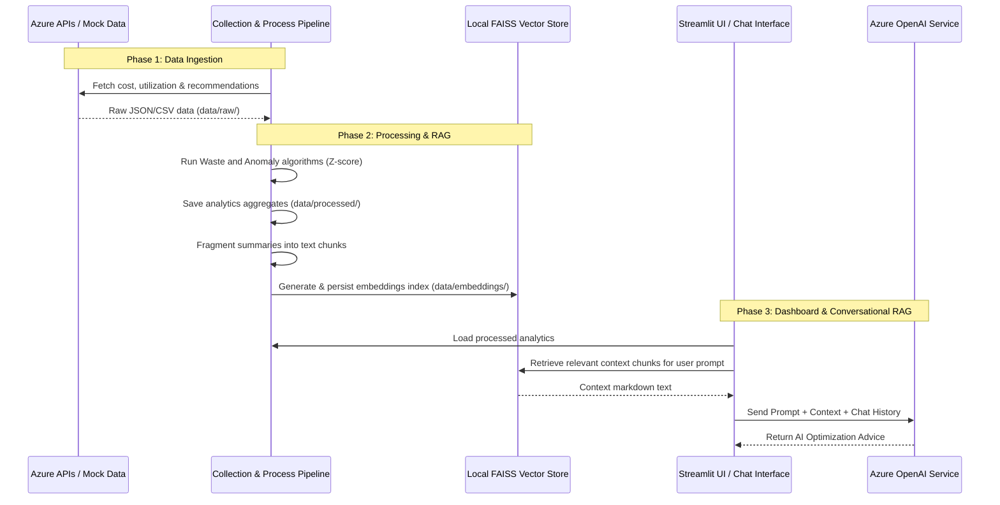

# System and Network Architecture Documentation

This document describes the full end-to-end technical, networking, and deployment architecture of the **AI-Powered Azure Cost Optimization Advisor**.

---

## 1. Network Topology (Hub-and-Spoke)

For security and isolation in enterprise deployments, the application is deployed in a standard **Hub-and-Spoke** network topology.

```mermaid
flowchart TD
    subgraph Internet ["Internet (Public)"]
        Client["User Web Browser"]
    end

    subgraph HubVNet ["Hub Virtual Network (10.0.0.0/16)"]
        subgraph AppGwSubnet ["App Gateway Subnet (10.0.1.0/24)"]
            AppGw["Azure Application Gateway (WAF_v2)"]
        end
        NSG_Hub["NSG: Allow HTTP/S (80/443), GatewayManager (65200-65535)"]
    end

    subgraph Peering ["VNet Peering (Bidirectional)"]
        Peer["Hub-Spoke Peering Links"]
    end

    subgraph SpokeVNet ["Spoke Virtual Network (10.1.0.0/16)"]
        subgraph CASubnet ["Container Apps Subnet (10.1.0.0/23)"]
            CAE["Container Apps Environment (Internal)"]
            Streamlit["Streamlit Dashboard App (Port 8501)"]
        end
        NSG_Spoke["NSG: Allow TCP 8501 from Hub VNet, Allow TCP 443 Outbound to Internet"]
    end

    Client -->|Public HTTP| AppGw
    AppGwSubnet --> Peering
    Peering --> CASubnet
    AppGw -->|Private Routing (Port 8501)| Streamlit
```

### Components:
- **Application Gateway (Hub)**: Acts as the single public entry point. It has a Standard/WAF_v2 SKU, running OWASP 3.2 rulesets in **Prevention** mode. It hosts the public frontend IP and listener on port 80.
- **VNet Peering**: Low-latency, private IP connection between the Hub VNet (`10.0.0.0/16`) and the Spoke VNet (`10.1.0.0/16`).
- **Azure Container Apps (Spoke)**: Runs the Streamlit dashboard in a private, delegated subnet (`10.1.0.0/23`) inside the Spoke VNet. The environment is configured with an **Internal Load Balancer (ILB)** so it has no public IP.
- **Network Security Groups (NSGs)**:
  - **Hub NSG**: Restricts inbound public traffic strictly to ports `80` and `443` (for normal traffic) and ports `65200-65535` (required for Azure Infrastructure Management).
  - **Spoke NSG**: Restricts inbound traffic on port `8501` solely to requests originating from the Hub VNet. Outbound traffic is restricted only to port `443` for secure communication with the Azure APIs and OpenAI endpoint.

---

## 2. Ingestion & Data Processing Flow

The core application operates as an end-to-end data pipeline:



### Core Pipeline Layers:
1. **Collector**: Handles authentication (Azure Identity) and queries the Azure Cost Management API, Azure Monitor (Utilization Metrics), and Azure Resource Graph (for orphaned disks/gateways). When API credentials are omitted, it transparently falls back to an offline synthetic data generator to allow zero-configuration local demos.
2. **Processor**:
   - **Cost Analyzer**: Aggregates spend metrics across subscriptions, resource groups, and specific services.
   - **Waste Detector**: Run heuristics to identify underutilized resources (e.g. VMs with average CPU < 5%, unused disks, orphaned gateways).
   - **Anomaly Detector**: Applies rolling Z-score mathematical algorithms to daily service costs to discover unexpected spending spikes.
3. **AI RAG (Retrieval-Augmented Generation)**:
   - Chunk summaries of waste recommendations.
   - Index the chunks into a local **FAISS Vector Store** using `langchain` and Azure OpenAI embeddings.
   - Answer conversational FinOps queries directly in the Streamlit UI chat sidebar using the vector indexes for relevant context.

---

## 3. CI/CD Architecture

DevOps pipelines are split into two decoupled processes to enforce separation of concerns and simplify release management:

```
                  ┌──────────────────────┐
                  │   Developer Commit   │
                  └──────────┬───────────┘
                             │
                             ▼
┌────────────────────────────────────────────────────────┐
│               Build Pipeline (CI)                      │
│ - Triggered automatically on commit to main            │
│ - Installs Python 3.11 & requirements                  │
│ - Runs unit tests & checks code coverage (pytest-cov)  │
│ - Compiles & tags Docker image                         │
│ - Pushes Docker image to Azure Container Registry (ACR)│
└────────────────────────────┬───────────────────────────┘
                             │
                             ▼
┌────────────────────────────────────────────────────────┐
│               Deploy Pipeline (CD)                     │
│ - Triggered on completion of Build Pipeline            │
│ - Performs dry-run checks: terraform validate & plan   │
│ - Runs Terraform Apply to establish network / container│
│ - Post-deploy check: validates Gateway backend routing │
└────────────────────────────────────────────────────────┘
```
